# Week 1: Introduction to Machine Learning

- [Week 1: Introduction to Machine Learning](#week-1-introduction-to-machine-learning)
  - [Overview of Machine Learning](#overview-of-machine-learning)
    - [Welcome to machine learning](#welcome-to-machine-learning)
    - [Applications of machine learning](#applications-of-machine-learning)
  - [Supervised vs. Unsupervised Machine Learning](#supervised-vs-unsupervised-machine-learning)
    - [What is machine learning](#what-is-machine-learning)
    - [Supervised learning part 1](#supervised-learning-part-1)
    - [Supervised learning part 2](#supervised-learning-part-2)
    - [Unsupervised learning part 1](#unsupervised-learning-part-1)
    - [Unsupervised learning part 2](#unsupervised-learning-part-2)
    - [Jupyter Notebooks](#jupyter-notebooks)
    - [Python and Jupyter Notebooks](#python-and-jupyter-notebooks)
  - [Practice Quiz: Supervised and Unsupervised learning](#practice-quiz-supervised-and-unsupervised-learning)
  - [Regression Model](#regression-model)
    - [Linear regression model part 1](#linear-regression-model-part-1)
    - [Linear regression model part 2](#linear-regression-model-part-2)
    - [Optional lab: Model representation](#optional-lab-model-representation)
    - [Cost function formula](#cost-function-formula)
    - [Cost function intuition](#cost-function-intuition)
    - [Visualizing the cost function](#visualizing-the-cost-function)
    - [Visualization examples](#visualization-examples)
    - [Optional lab: Cost function](#optional-lab-cost-function)
  - [Practice Quiz: Regression Model](#practice-quiz-regression-model)
  - [Train the model with gradient descent](#train-the-model-with-gradient-descent)
    - [Gradient descent](#gradient-descent)
    - [Implementing gradient descent](#implementing-gradient-descent)
    - [Gradient Descent intuition](#gradient-descent-intuition)
    - [Learning rate](#learning-rate)
    - [Gradient descent for linear regression](#gradient-descent-for-linear-regression)
    - [Running gradient descent for Training linear regression](#running-gradient-descent-for-training-linear-regression)
    - [Optional lab: Gradient Descent](#optional-lab-gradient-descent)
  - [Practice Quiz: Train the model with gradient descent](#practice-quiz-train-the-model-with-gradient-descent)

Welcome to the Machine Learning Specialization! You're joining millions of others who have taken either this or the original course, which led to the founding of Coursera, and has helped millions of other learners, like you, take a look at the exciting world of machine learning!

**Learning Objectives**
- Define machine learning
- Define supervised learning
- Define unsupervised learning
- Write and run Python code in Jupyter Notebooks
- Define a regression model
- Implement and visualize a cost function
- Implement gradient descent
- Optimize a regression model using gradient descent

## Overview of Machine Learning
### Welcome to machine learning

### Applications of machine learning

## Supervised vs. Unsupervised Machine Learning
### What is machine learning
Arthur Samuel (1959) defined machine learning as a the field of study that gives computers ability to learn without being explicitly programmed.

The two main types of machine learning are **supervised learning** and **unsupervised learning**.

Of these two, supervised learning is the type of machine learning that is used most in many real-world applications and has seen the most rapid advancements and innovation. In this specialization, which has three courses in total, the first and second courses will focus on supervised learning, and the third will focus on unsupervised learning, recommender systems, and reinforcement learning. By far, the most used types of learning algorithms today are supervised learning, unsupervised learning, and recommender systems. 

In this class, one of the relatively unique things you learn is you learn a lot about the best practices for how to actually develop a practical, valuable machine learning system. 

### Supervised learning part 1
99 percent of the economic value created by machine learning today is through one type of machine learning, which is called supervised learning.

Supervised learning refers to algorithms that learn x to y or input to output mappings.

### Supervised learning part 2

### Unsupervised learning part 1

### Unsupervised learning part 2

### Jupyter Notebooks

### Python and Jupyter Notebooks

## Practice Quiz: Supervised and Unsupervised learning
Refer to [greyhatguy007](greyhatguy007/Practice%20quiz-%20Supervised%20vs%20unsupervised%20learning/README.md) solutions for now.

## Regression Model
### Linear regression model part 1
Regression models: Any supervised model that preidcts a number such as 220,000 or 1.5 or -33.2.
Clasification models" Predicts categories or discrete categories, such as predicting if a picture is a cat or dog. Or if given a medical record, it has to predict if a patient has a particular disease.

Linear regression model
- Model that fits a straight line to our data.
- It's called regression model because it predicts the numbers as the output like prices in dollars.

**Notations**

- Training set - Dataset used ti train the model
- $x$ - input variable/features (e.g., House size in feet)
- $y$ - output/Target variable (e.g., House price in $1000s)
- $m$ - no. of training examples
  - $(x, y)$ - single training example | e.g., $(2104,400)$
  - $(x^{(i)}, y^{(i)})$ - $i^{th}$ training example | e.g., $(x^{(3)}, y^{(3)}) = (1534, 315)$
    - Here, $i$ refers to the index/row in the training set and is not an exponent
    - Remember, $X^{(i)} \neq X^{i}$

### Linear regression model part 2

When we train the model with training data, it will provide a function $f$, sometimes called as *hypothesis*. The job of the function is to take, input $x$ and estimate or predict the output $y$. This predicted output is $\hat{y}$.

- $f$ - Function
- $x$ - model input/features
- $y$ - actual output/target
- $\hat{y}$ - predicted/ estimated output 
  - $\hat{y} = f(x)$

How to represent, $f$?
- $f_{w, b}{(x)} = wx + b$, assuming the function is a straight line
  - $f$ is a function that takes $x$ as input, and depending upon the values of $w$ and $b$, $f$  will output some values of the prediction, $\hat{y}$.
  - For simplicity, $f_{w, b}{(x)}$ will be represented as $f(x)$.

> Univariate linear regression => Linear regression with one input variable.

### Optional lab: Model representation
Refer to [greyhatguy007](greyhatguy007/Optional%20Labs/C1_W1_Lab03_Model_Representation_Soln.ipynb) solutions for now.

### Cost function formula

In order to implement linear regression, first step is to define cost function, which will tell us how well the model is doing.

- Training set that contains input features $x$ and output targets $y$.
- Model: Linear function, $f_{w, b}{(x)} = wx + b$
  - $w$ and $b$ are called **parameters** (a.k.a **coefficients** or **weights**) of the model that can be adjusted during training to improve the model

With linear regression, we want to choose value for parameters $w$ and $b$ such that the straight line we get from the function $f$ somehow fits the data well.

$$ \hat{y} = f_{w, b}{(x)} = wx + b$$

How to find $w$ and $b$, such that predicted value $\hat{y} _{i}$ is close to actual value $y _{i}$ for all $(x^{(i)}, y^{(i)})$ ?
- To answer this question, let's first measure how well the line fits the training data using the cost function. 

**Cost function** - <u>**Squared error**</u> cost function (for linear regression)
 *Let's build it step by step*
- Takes prediction $\hat{y} _{i}$ and compares it with to target $y _{i}$ by computing error as $\hat{y} _{i} - y _{i}$.
- Then, let's compute the square of the error $\implies$  ${(\hat{y} _{i} - y _{i})}^{2}$
- Let's compute it for different training examples  $\implies$ $\sum_{i=1}^{m}{(\hat{y} _{i} - y _{i})}^{2}$
- To ensure that the cost function doesn't automatically get bigger with more training samples, let's compute the average squared error instead of total squared error $\implies$  $\frac{1}{2m}\sum _{i=1}^{m}{(\hat{y} _{i} - y _{i})}^{2}$

$$ J(w,b) = \frac{1}{2m}\sum_{i=1}^{m}{(\hat{y}_{i} - y_{i})}^{2}$$  
$$ J(w,b) = \frac{1}{2m}\sum_{i=1}^{m}{(f_{w, b}{(x^{i})}  - y_{i})}^{2}$$  

### Cost function intuition
9

We want to fit the model using straight line, by choosing $w$ and $b$ such that it fits the training data well (i.e., by making $J(w,b)$ as small as possible).

| Term | Org. equation | Simplified |
| :---- | :-------------: | :----------: |
| Model | $f_{w, b}{(x)} = wx + b$ |  $f_{w}{(x)} = wx$ by setting $b=0$|
| Parameters | $w,b$ | $w$ |
| Cost function | $J(w,b) = \frac{1}{2m}\sum_{i=1}^{m}{(f_{w, b}{x^{(i)}}-y^{(i)})}^{2}$ |  $J(w) = \frac{1}{2m}\sum_{i=1}^{m}{(f_{w}{x^{(i)}}-y^{(i)})}^{2}$ |
| Goal | $\underset{w,b}{\text{minimize}}\phantom{1}J(w,b)$ | $\underset{w}{\text{minimize}}\phantom{1}J(w)$ |

Using the simplified model, let's see how the cost function changes if we choose e different value for parameter $w$. 

Say, we have 3 training samples at $(1,1)$, $(2,2)$ and $(3,3)$. For different values of $w$, we can compute $f _{w}(x)$ and the corresponding $J(w)$ and plot it as follows:

 

| $w$ | $f _{w}(x)=wx$ | $J(w)$ | 
| --- | ----------- | ----------- |
| $w=1$ | $f(x) = x$ |  $J(1)=\frac{1}{2m}(0^2 + 0^2 + 0^2)$ = 0 |
| $w=.5$ | $f(x) = 0.5x$ |  $J(0.5)=\frac{1}{2m}[(0.5-1)^2 + (1-2)^2 + (1.5-3)^2]= \frac{1}{2*3}[3.5] \approx 0.58$
| $w=0$ | $f(x) = 0$ |  $J(0.5)=\frac{1}{2m}[(0-1)^2 + (0-2)^2 + (0-3)^2]= \frac{1}{2*3}[13] \approx 6.5$ |
| $w=-.5$ | $f(x) = -0.5x$ |  $J(-0.5)=\frac{1}{2m}[(-0.5-1)^2 + (-1-2)^2 + (-1.5-3)^2]= \frac{1}{2*3}[14] \approx 2.3$ |
|

Since $J$ is the cost function that measures how big the squared errors are, so choosing $w$ that minimizes these squared errors, makes them errors as small as possible, gives us a good model.

> **Goal of linear regression** 
> - Simplliefed case: $\underset{w}{\text{minimize}}\phantom{1}J(w)$  
> - General case: $\underset{w,b}{\text{minimize}}\phantom{1}J(w,b)$ 
 
### Visualizing the cost function

| Term | Org. equation | Simplified |
| :---- | :-------------: | :----------: |
| Model | $f_{w, b}{(x)} = wx + b$ |  $f_{w}{(x)} = wx$ by setting $b=0$|
| Parameters | $w,b$ | $w$ |
| Cost function | $J(w,b) = \frac{1}{2m}\sum_{i=1}^{m}{(f_{w, b}{x^{(i)}}-y^{(i)})}^{2}$ |  $J(w) = \frac{1}{2m}\sum_{i=1}^{m}{(f_{w}{x^{(i)}}-y^{(i)})}^{2}$ |
| Goal | $\underset{w,b}{\text{minimize}}\phantom{1}J(w,b)$ | $\underset{w}{\text{minimize}}\phantom{1}J(w)$ |

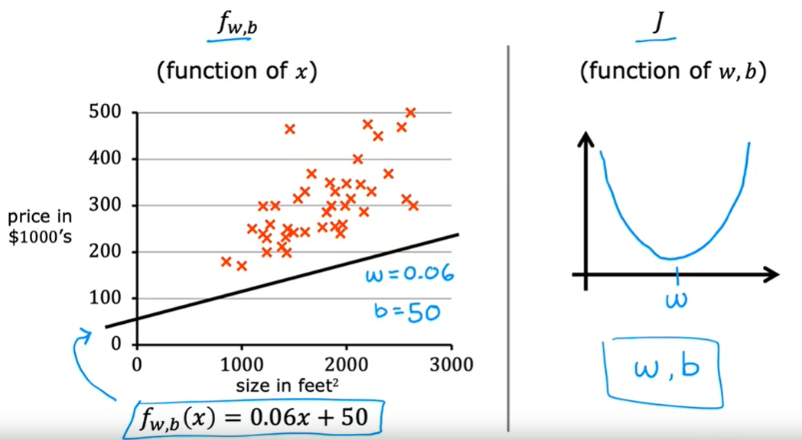
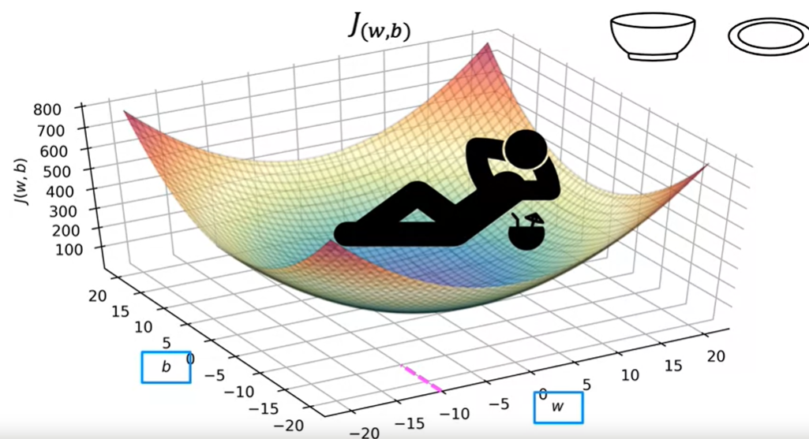

Since, we have two parameters $w$ and $b$ in this problem, the cost function has to be visualized in 3D. Rather than using 3D surface plots, we can plot it using contour plots. 

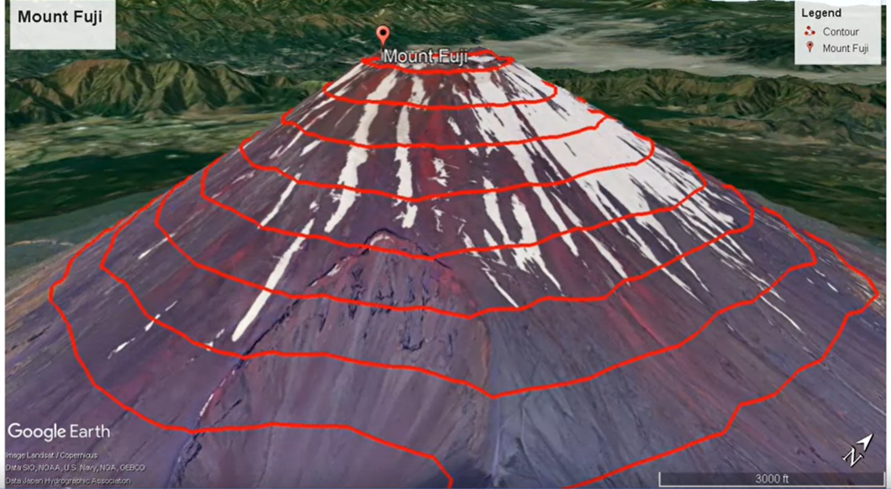
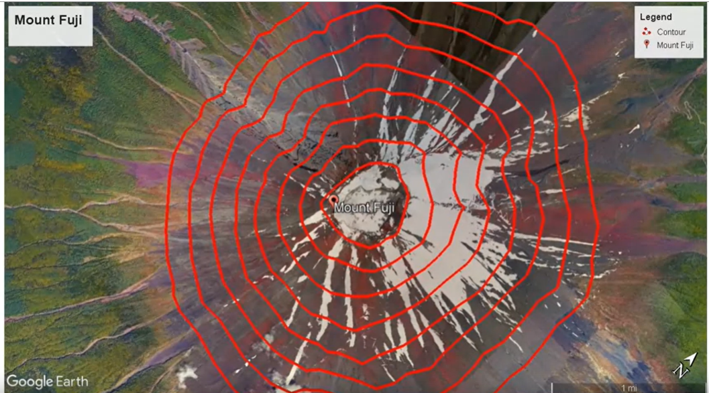

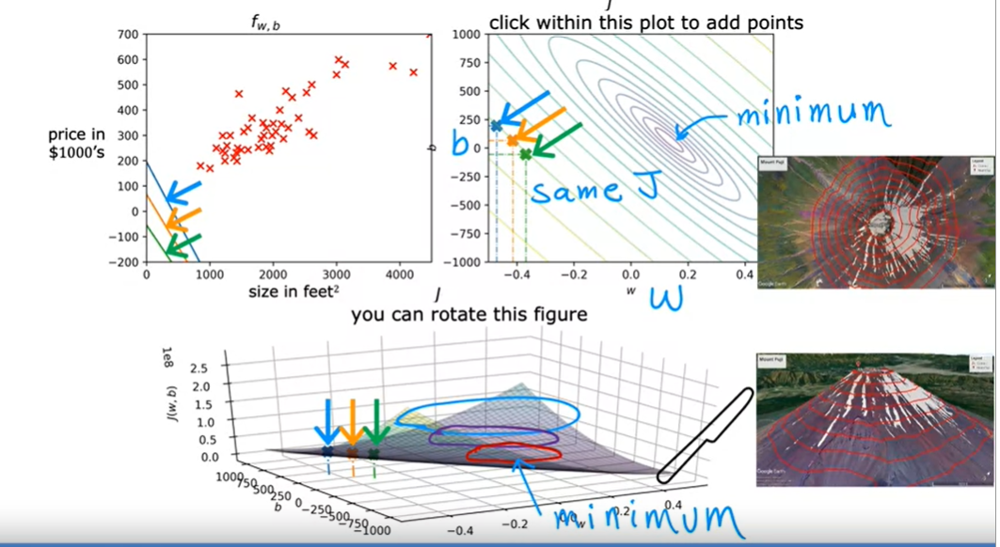

The bottom of above fig is a 3D-surface plot of the cost function, $J$. On upper right, we have contour plot of the same cost function. The two axis in the contour plot are $w$ and $b$. 

### Visualization examples

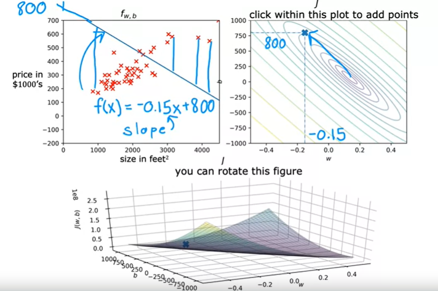
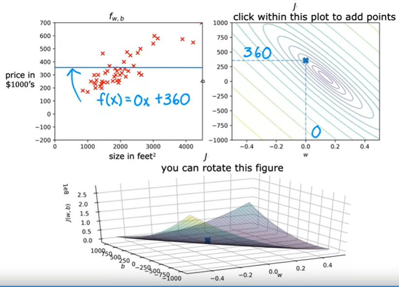

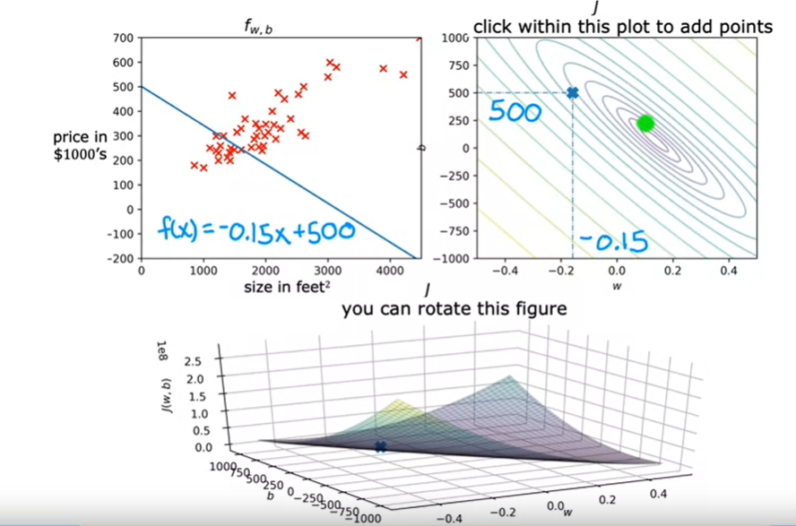
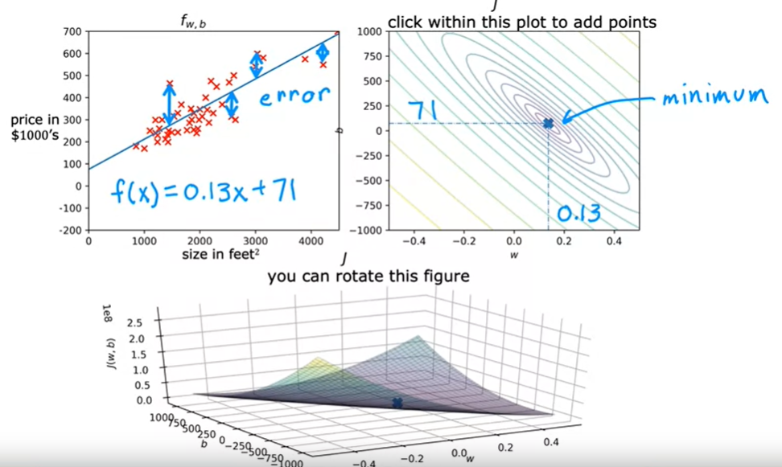

| $w$ | $b$ | $f(x)$ | $J(w,b)$ |
| ---: | ---: | ------: | -------- | 
| $-0.15$ | $800$ | $-0.15x + 800$ | Not a great fit |
| $0$ | $360$ | $0x + 360$ | Still bad fit |
| $-0.15$ | $500$ | $-0.15x + 500$ | Not a great fit |
| $0.13$ | $71$ | $0.13x + 71$ | Error is minimum |

The table (and figures) above illustrates that different choices of parameters affect the line $f(x)$ and that corresponds to different values of cost $J$.

### Optional lab: Cost function
Refer to [greyhatguy007](greyhatguy007/Optional%20Labs/C1_W1_Lab04_Cost_function_Soln.ipynb) solutions for now.

## Practice Quiz: Regression Model

## Train the model with gradient descent
### Gradient descent

**Gradient Descent**
- Algo that can be used to find the optimal parameters $w$ and $b$ that minimises the cost function, $J(w,b).
- Is used not only in linear regression, but also for training some of the most advanced neural network models, including deep learning models.

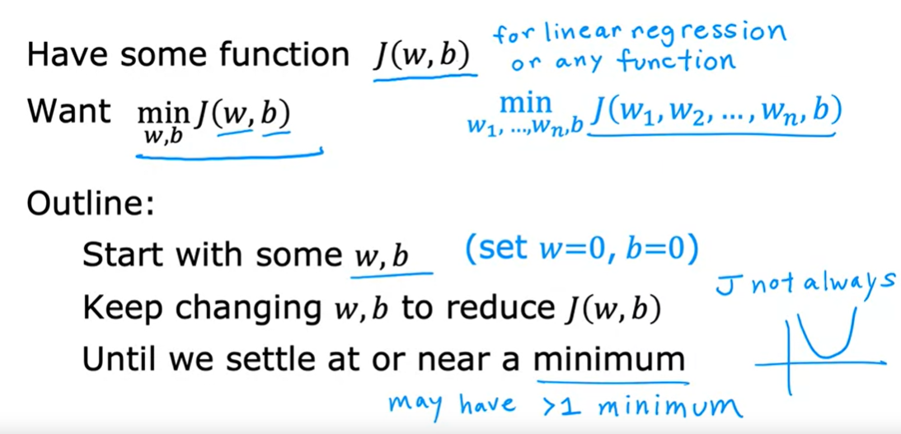
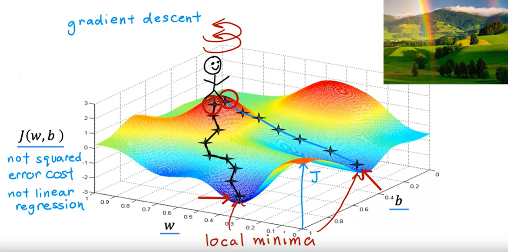

For linear regression, the cost function is always squared error cost function. However, for **not** linear regressions, the cost function is not squared error cost function.

In layman words, our goal is to start somewhere randomly in this cost function and get to the bottom of one of these valleys efficiently as possible.
- What the gradient descent algorithm does is we are going to spin around 360 degrees and ask ourself, if I were to take a tiny little baby step in one direction, and I want to go downhill as quickly as possible to one of these valleys. $\Rightarrow$ Mathematically, this is the **direction of the steepest descent**. It means that when we take a tiny baby little step, this takes us downhill faster than a tiny little baby step we could have taken in any other direction. Eventually, we might end up in the local minima after series of this baby steps.

### Implementing gradient descent

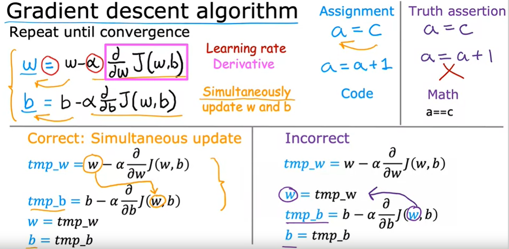

Remember, in the above fig, $=$ means assignment, and not truth assertion (checking the equality of the two values). Also, remember all the parameters needs to be *simultaneously updated* (refer bottom left section)

<u>*Repeat until convergence*</u>
$$w=w-\alpha\frac{\partial}{\partial w}J(w,b)$$
$$b=b-\alpha\frac{\partial}{\partial b}J(w,b)$$
where 
- $\alpha$ is **learning rate** between $0$ and $1$, that controls how big of a step we take downhill $\Rightarrow$ Huge $\alpha$ corresponds to very aggressive gradient descent procedure as will take huge steps downhill.
- $\frac{\partial}{\partial w}J(w,b)$ is the **partial derivative** term of cost function $J$. In layman terms, it tell us the direction (of the steepest descent) in which we want to take baby steps.

### Gradient Descent intuition

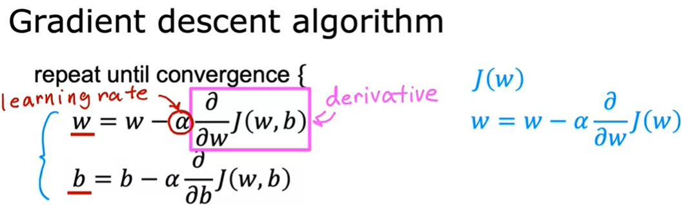

Let's say that we have a cost function, $J$ of just one parameter $w$. So, gradient descent now looks like
$$ w=w-\alpha\frac{\partial}{\partial w}J(w) $$
$$\underset{w}{\text{min}}\phantom{1}J(w)$$

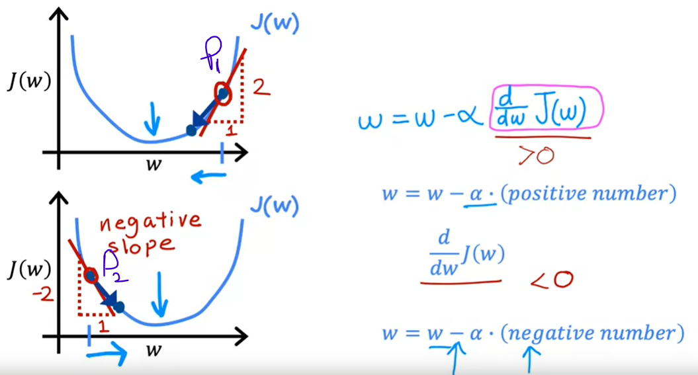

- When the $\frac{\mathrm{d}}{\mathrm{d}w}J(w)$ is positive, the updated $w$ is smaller. $\Rightarrow$ On the graph, we are moving to the left as we are decreasing the value of $w$.
  - > At point $P _{1}$, derivative at this point is to draw a tangent line, which is a straight line that touches this curve at point $P _{1}$. The slope of this tangent line is the derivative of the function $J$ at this point. When the tangent lins is pointing up and to the right, the slope is positive.
- When the $\frac{\mathrm{d}}{\mathrm{d}w}J(w)$ is negative, the updated $w$ is larger. $\Rightarrow$ On the graph, we are moving to the right as we are increasing the value of $w$.

### Learning rate

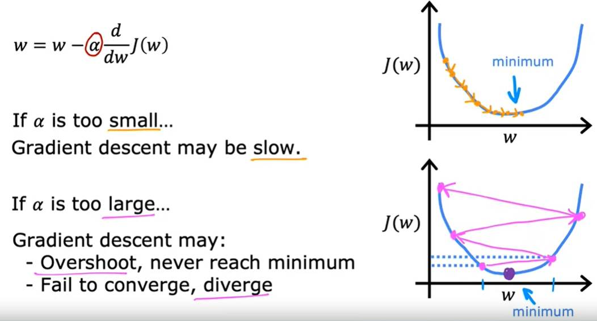

$w=w-\alpha\frac{\partial}{\partial w}J(w)$
- If $\alpha$ is too small, gradient descent will work, but may be slow as it will be taking tiny tiny steps every steps  before it reaches the minima
- If $\alpha$ is too large, though the derivative might be a small value that points in the right direction, as the learning rate is multiplied with derivative, it will end up being a very large value and might overshoot. As we will be taking huge steps, we may never reach minimum. $\Rightarrow$ Fail to converge, and may even diverge. 

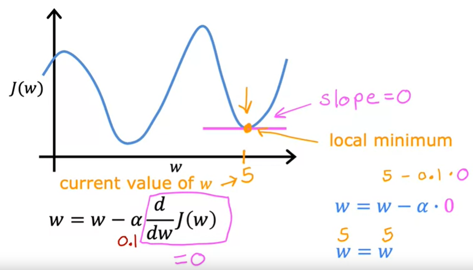

In the above case, the final value of $w$ that will be selected by gradient descent (in the aim of reaching local minimum) will depend on it's initial value at the start, $w _{initial}$ and learning rate, $\alpha$.  

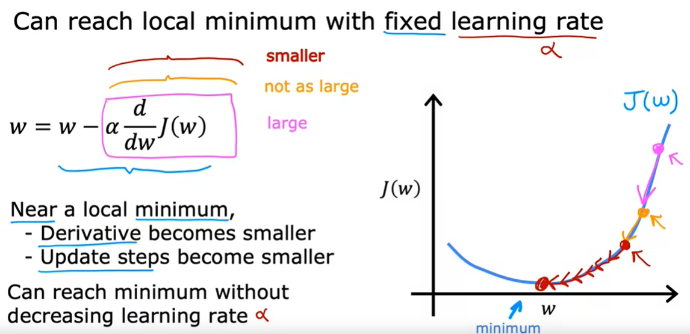

As we get closer to the local minimum, the gradient descent starts making smaller steps, because as we approach local minimum, the derivative automatically gets smaller. $\Rightarrow$ Update steps also gets smaller.

### Gradient descent for linear regression

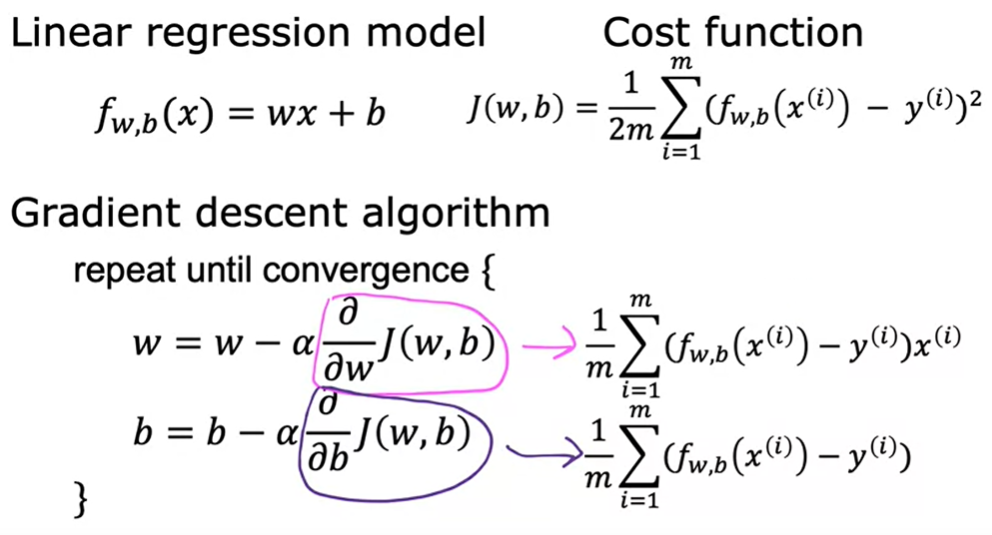

- Linear regression model
  - $$f _{w,b}(x)=wx+b$$
- Cost function
  - $$J(w,b) = \frac{1}{2m}\sum _{i=1}^{m}(f _{w,b}(x^{(i)})-y^{(i)})^2$$
- Gradient descent alogirthm
  - repeat until convergence
    - $$w=w-\alpha\frac{\partial}{\partial w}J(w,b) \Rightarrow \frac{\partial}{\partial w}J(w,b) = \frac{1}{m}\sum _{i=1}^{m}(f _{w,b}(x^{(i)})-y^{(i)})x^{i}$$
    - $$b=b-\alpha\frac{\partial}{\partial b}J(w,b) \Rightarrow \frac{\partial}{\partial b}J(w,b) = \frac{1}{m}\sum _{i=1}^{m}(f _{w,b}(x^{(i)})-y^{(i)})$$

But, how did we compute the the parital derivatives for $w$ and $b$?

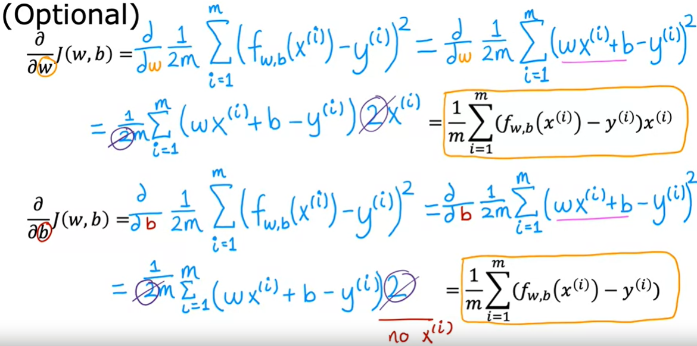

$$ \frac{\partial}{\partial w}J(w,b) = \frac{\partial}{\partial w}\frac{1}{2m}\sum _{i=1}^{m}(f _{w,b}(x^{(i)})-y^{(i)})^2 = \frac{\partial}{\partial w}\frac{1}{2m}\sum _{i=1}^{m}(wx^{(i)}+b-y^{(i)})^2 $$
$$ \phantom{10}  = \frac{1}{2m}\sum _{i=1}^{m}(wx^{(i)}+b-y^{(i)})\times 2x^{(i)} = \frac{1}{m}\sum _{i=1}^{m}(f _{w,b}(x^{(i)})-y^{(i)})x^{i}$$

$$ \frac{\partial}{\partial b}J(w,b) = \frac{\partial}{\partial b}\frac{1}{2m}\sum _{i=1}^{m}(f _{w,b}(x^{(i)})-y^{(i)})^2 = \frac{\partial}{\partial b}\frac{1}{2m}\sum _{i=1}^{m}(wx^{(i)}+b-y^{(i)})^2 $$
$$ \phantom{10}  = \frac{1}{2m}\sum _{i=1}^{m}(wx^{(i)}+b-y^{(i)})\times 2 = \frac{1}{m}\sum _{i=1}^{m}(f _{w,b}(x^{(i)})-y^{(i)})$$

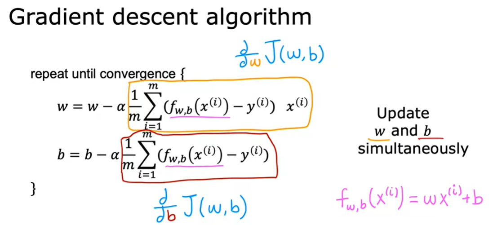

### Running gradient descent for Training linear regression

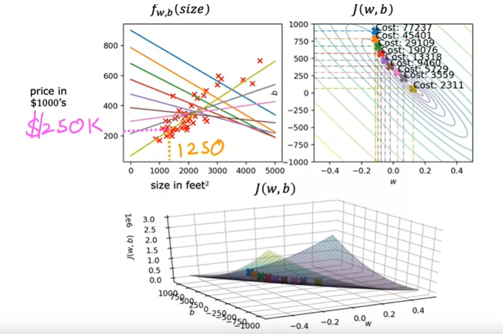

Linear regression model and data on the upper left. The contour plot of cost function on upper right. Bottom left contains the surface plot of the cost function.
- $w = -0.1$, $b=900$ $\Rightarrow f(x)= 0.1x+900 \Rightarrow J(w,b) = 77237$ 
- After taking a step in gradient descent, $\Rightarrow J(w,b) = 45401$ 
- ...
- After taking a step in gradient descent, $\Rightarrow J(w,b) = 2311$ 
- As we take more steps, the cost is descreasing, and one the top right, we can see that the we have reached a global minimum and on the top left, we can see the straigth line fit (dark yellow color), which is relatively good fit to the data.

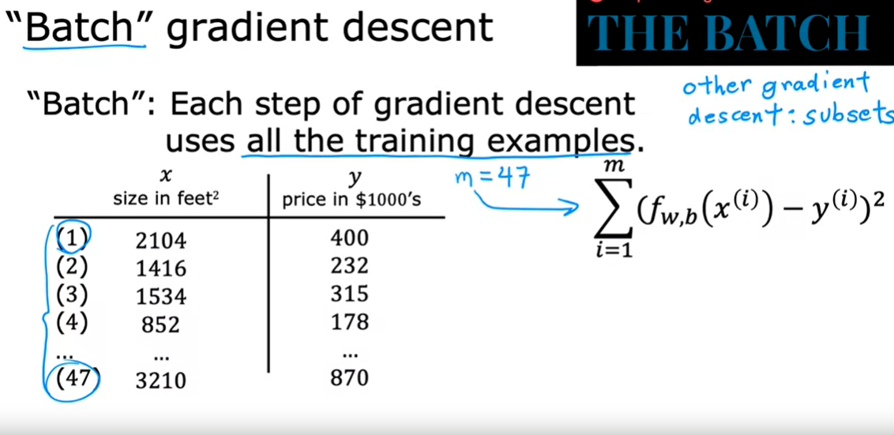

> **Batch gradient descent**: **"Batch"** implies that for each step of gradient descent uses all the training examples, instead of subset of training data. The name "batch" might be not that intuitive though.

There are other versions of gradient descent that do not look at the entire training set, but instead smaller subsets of training data for each update step. However, for linear regression, we will be using linear regression. 

### Optional lab: Gradient Descent

## Practice Quiz: Train the model with gradient descent
