# Week 1: Introduction to Machine Learning

- [Week 1: Introduction to Machine Learning](#week-1-introduction-to-machine-learning)
  - [Overview of Machine Learning](#overview-of-machine-learning)
    - [Welcome to machine learning](#welcome-to-machine-learning)
    - [Applications of machine learning](#applications-of-machine-learning)
  - [Supervised vs. Unsupervised Machine Learning](#supervised-vs-unsupervised-machine-learning)
    - [What is machine learning](#what-is-machine-learning)
    - [Supervised learning part 1](#supervised-learning-part-1)
    - [Supervised learning part 2](#supervised-learning-part-2)
    - [Unsupervised learning part 1](#unsupervised-learning-part-1)
    - [Unsupervised learning part 2](#unsupervised-learning-part-2)
    - [Jupyter Notebooks](#jupyter-notebooks)
    - [Python and Jupyter Notebooks](#python-and-jupyter-notebooks)
  - [Practice Quiz: Supervised and Unsupervised learning](#practice-quiz-supervised-and-unsupervised-learning)
  - [Regression Model](#regression-model)
    - [Linear regression model part 1](#linear-regression-model-part-1)
    - [Linear regression model part 2](#linear-regression-model-part-2)
    - [Optional lab: Model representation](#optional-lab-model-representation)
    - [Cost function formula](#cost-function-formula)
    - [Cost function intuition](#cost-function-intuition)
    - [Visualizing the cost function](#visualizing-the-cost-function)
    - [Visualization examples](#visualization-examples)
    - [Optional lab: Cost function](#optional-lab-cost-function)
  - [Practice Quiz": Regression Model](#practice-quiz-regression-model)
  - [Train the model with gradient descent](#train-the-model-with-gradient-descent)
    - [Gradient descent](#gradient-descent)
    - [Implementing gradient descent](#implementing-gradient-descent)
    - [Gradient Descent intuition](#gradient-descent-intuition)
    - [Learning rate](#learning-rate)
    - [Gradient descent for linear regression](#gradient-descent-for-linear-regression)
    - [Running gradient descent](#running-gradient-descent)
    - [Optional lab: Gradient Descent](#optional-lab-gradient-descent)
  - [Practice Quiz: Train the model with gradient descent](#practice-quiz-train-the-model-with-gradient-descent)

Welcome to the Machine Learning Specialization! You're joining millions of others who have taken either this or the original course, which led to the founding of Coursera, and has helped millions of other learners, like you, take a look at the exciting world of machine learning!

**Learning Objectives**
- Define machine learning
- Define supervised learning
- Define unsupervised learning
- Write and run Python code in Jupyter Notebooks
- Define a regression model
- Implement and visualize a cost function
- Implement gradient descent
- Optimize a regression model using gradient descent

## Overview of Machine Learning
### Welcome to machine learning

### Applications of machine learning

## Supervised vs. Unsupervised Machine Learning
### What is machine learning
Arthur Samuel (1959) defined machine learning as a the field of study that gives computers ability to learn without being explicitly programmed.

The two main types of machine learning are **supervised learning** and **unsupervised learning**.

Of these two, supervised learning is the type of machine learning that is used most in many real-world applications and has seen the most rapid advancements and innovation. In this specialization, which has three courses in total, the first and second courses will focus on supervised learning, and the third will focus on unsupervised learning, recommender systems, and reinforcement learning. By far, the most used types of learning algorithms today are supervised learning, unsupervised learning, and recommender systems. 

In this class, one of the relatively unique things you learn is you learn a lot about the best practices for how to actually develop a practical, valuable machine learning system. 

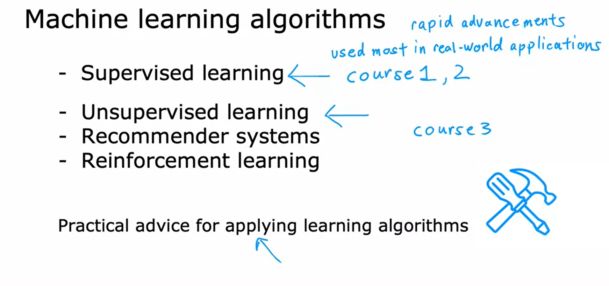

### Supervised learning part 1
99 percent of the economic value created by machine learning today is through one type of machine learning, which is called supervised learning.

Supervised learning refers to algorithms that learn x to y or input to output mappings.

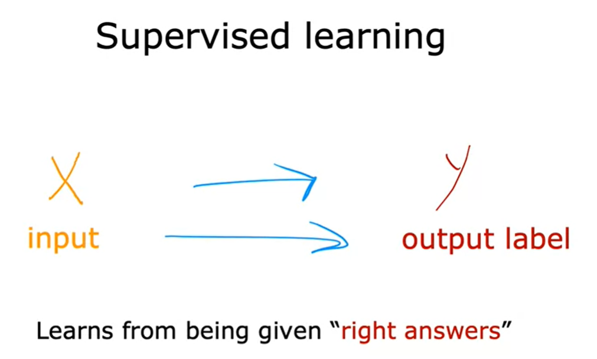

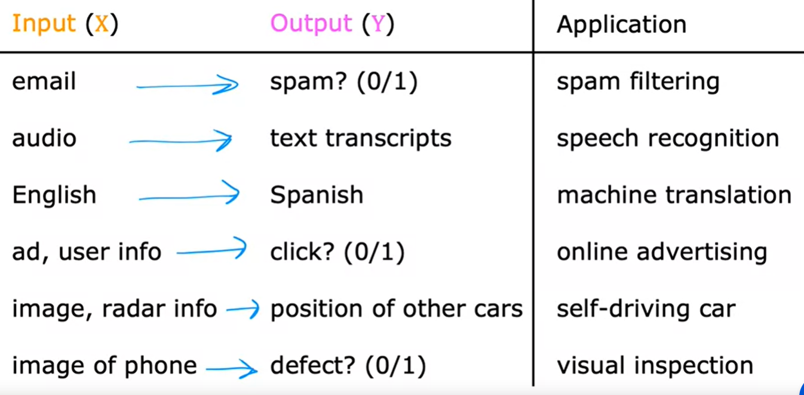

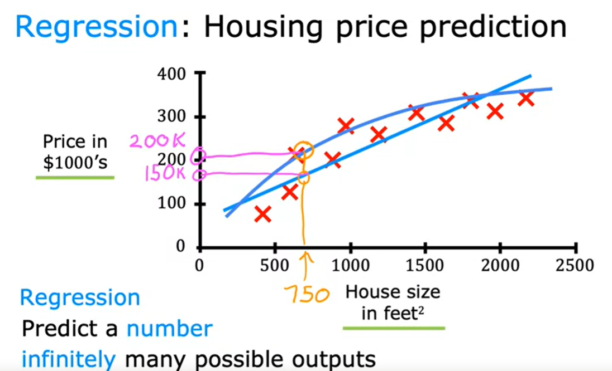

### Supervised learning part 2

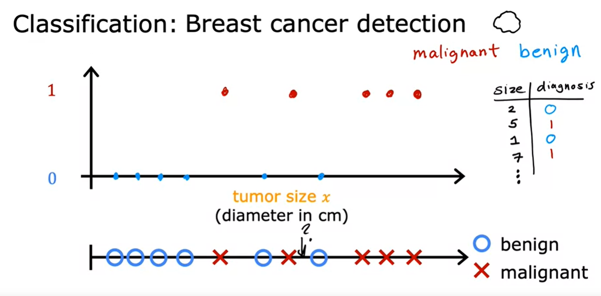

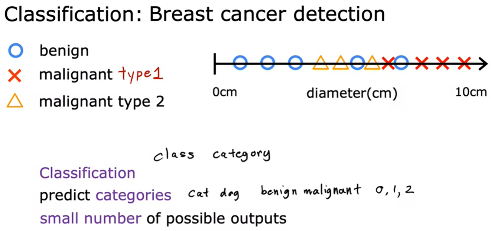

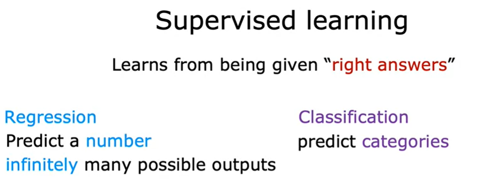

### Unsupervised learning part 1

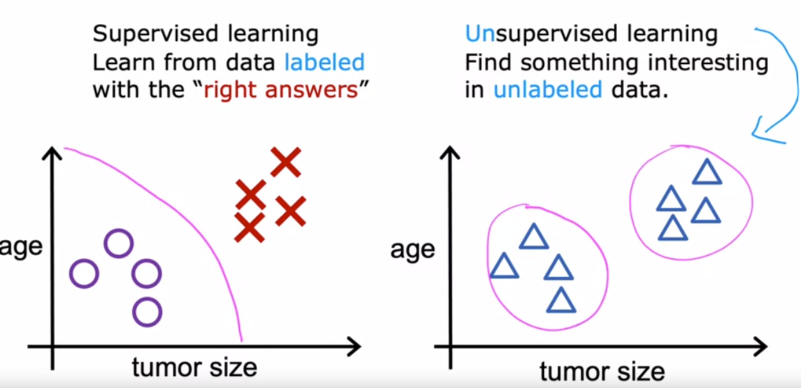

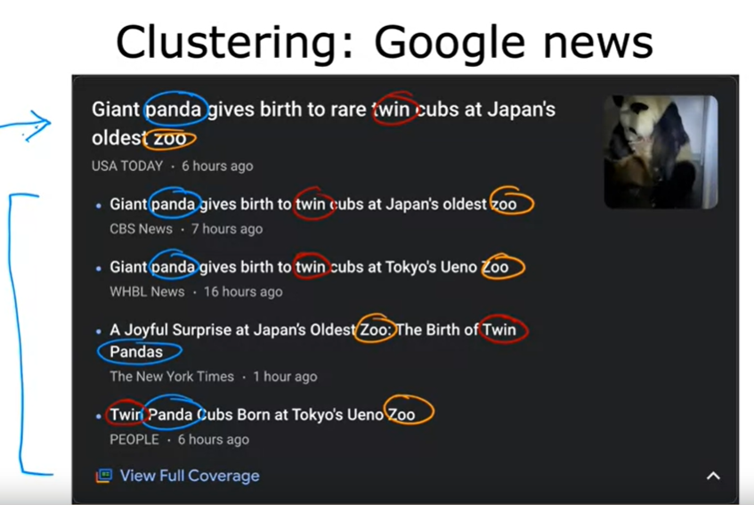

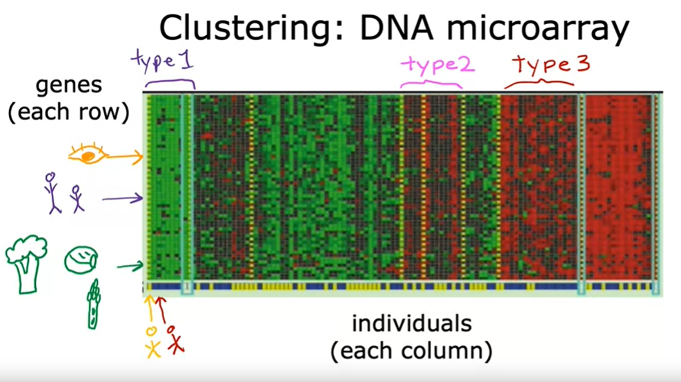

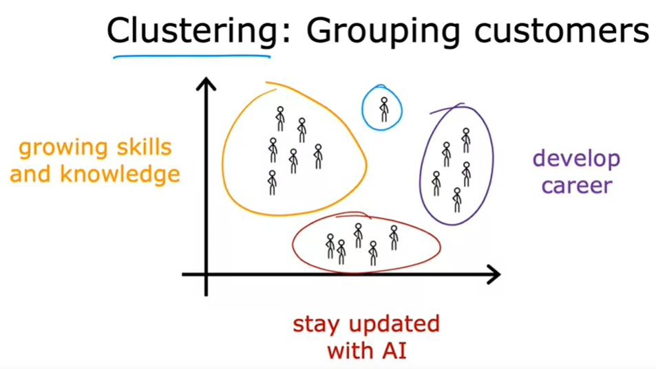

### Unsupervised learning part 2

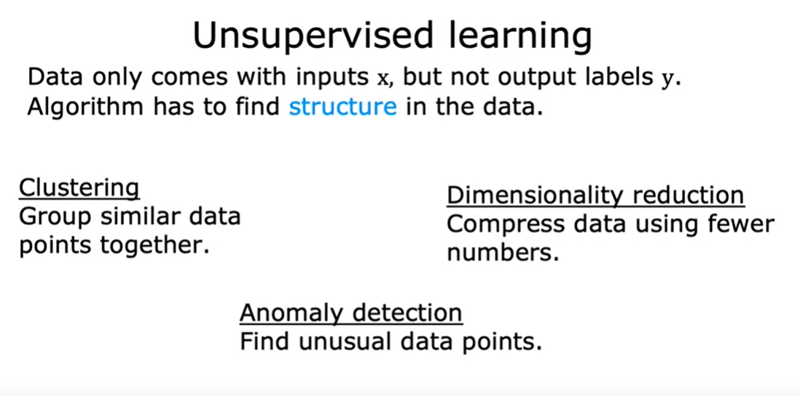

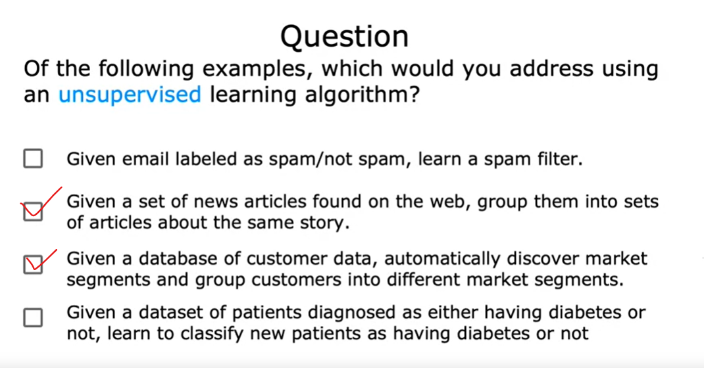

### Jupyter Notebooks

### Python and Jupyter Notebooks

## Practice Quiz: Supervised and Unsupervised learning
Refer to [greyhatguy007](greyhatguy007/Practice%20quiz-%20Supervised%20vs%20unsupervised%20learning/README.md) solutions for now.

## Regression Model
### Linear regression model part 1
Regression models: Any supervised model that preidcts a number such as 220,000 or 1.5 or -33.2.
Clasification models" Predicts categories or discrete categories, such as predicting if a picture is a cat or dog. Or if given a medical record, it has to predict if a patient has a particular disease.

Linear regression model
- Model that fits a straight line to our data.
- It's called regression model because it predicts the numbers as the output like prices in dollars.

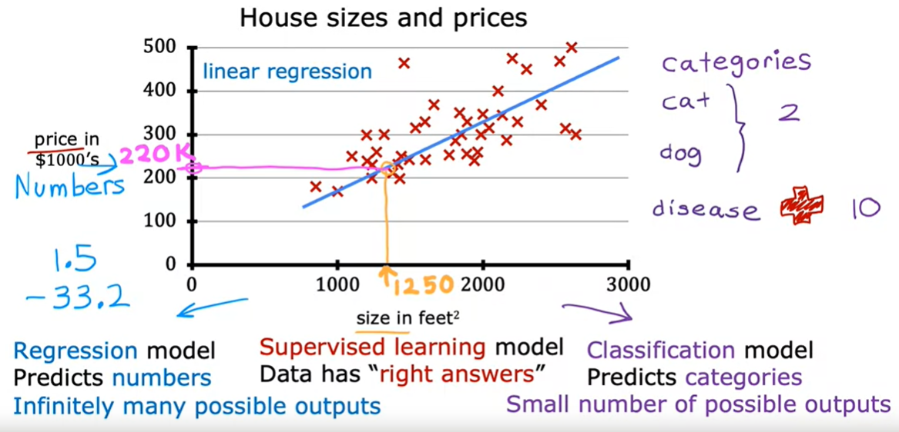

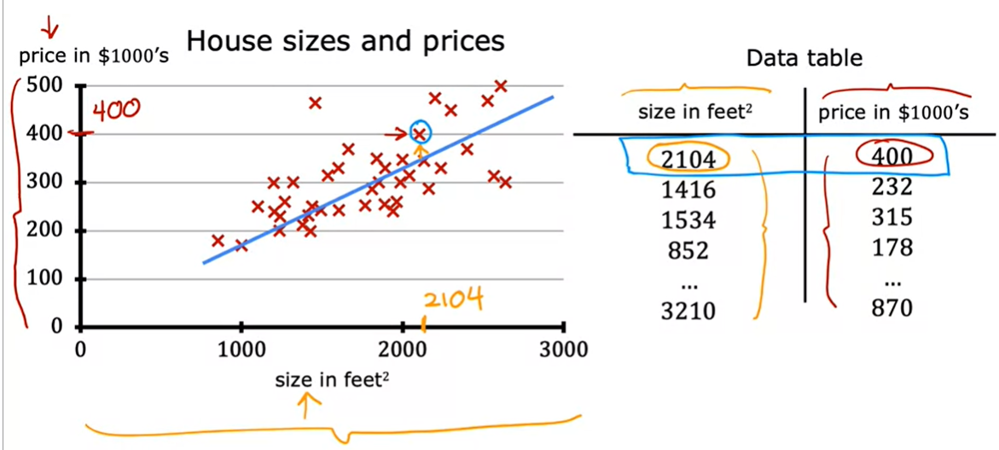

**Notations**

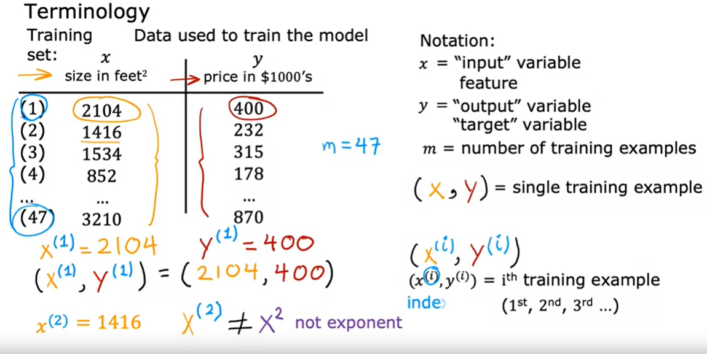

- Training set - Dataset used ti train the model
- $x$ - input variable/features (e.g., House size in feet)
- $y$ - output/Target variable (e.g., House price in $1000s)
- $m$ - no. of training examples
  - $(x, y)$ - single training example | e.g., $(2104,400)$
  - $(x^{(i)}, y^{(i)})$ - $i^{th}$ training example | e.g., $(x^{(3)}, y^{(3)}) = (1534, 315)$
    - Here, $i$ refers to the index/row in the training set and is not an exponent
    - Remember, $X^{(i)} \neq X^{i}$

### Linear regression model part 2

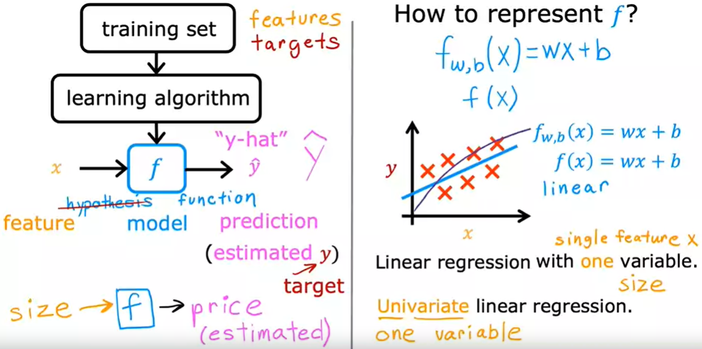

When we train the model with training data, it will provide a function $f$, sometimes called as *hypothesis*. The job of the function is to take, input $x$ and estimate or predict the output $y$. This predicted output is $\hat{y}$.

- $f$ - Function
- $x$ - model input/features
- $y$ - actual output/target
- $\hat{y}$ - predicted/ estimated output 
  - $\hat{y} = f(x)$

How to represent, $f$?
- $f_{w, b}{(x)} = wx + b$, assuming the function is a straight line
  - $f$ is a function that takes $x$ as input, and depending upon the values of $w$ and $b$, $f$  will output some values of the prediction, $\hat{y}$.
  - For simplicity, $f_{w, b}{(x)}$ will be represented as $f(x)$.

> Univariate linear regression => Linear regression with one input variable.

### Optional lab: Model representation
Refer to [greyhatguy007](greyhatguy007/Optional%20Labs/C1_W1_Lab03_Model_Representation_Soln.ipynb) solutions for now.

### Cost function formula

In order to implement linear regression, first step is to define cost function, which will tell us how well the model is doing.

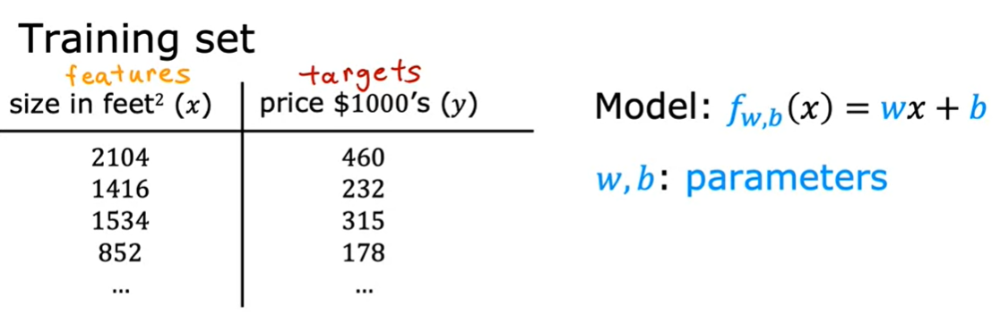

- Training set that contains input features $x$ and output targets $y$.
- Model: Linear function, $f_{w, b}{(x)} = wx + b$
  - $w$ and $b$ are called **parameters** (a.k.a **coefficients** or **weights**) of the model that can be adjusted during training to improve the model

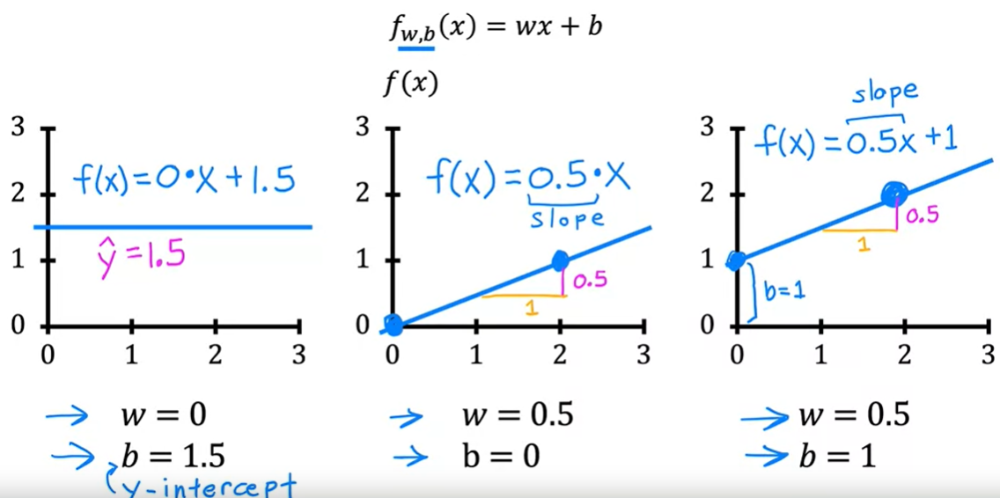

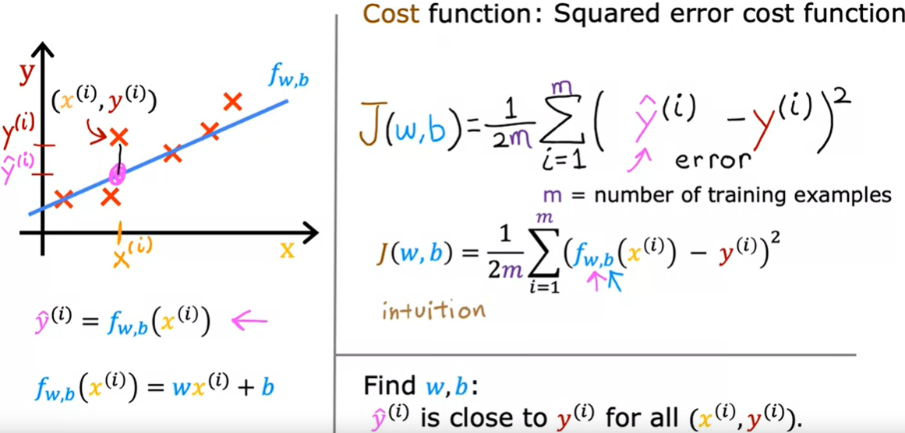

With linear regression, we want to choose value for parameters $w$ and $b$ such that the straight line we get from the function $f$ somehow fits the data well.

$$ \hat{y} = f_{w, b}{(x)} = wx + b$$

How to find $w$ and $b$, such that predicted value $\hat{y} _{i}$ is close to actual value $y _{i}$ for all $(x^{(i)}, y^{(i)})$ ?
- To answer this question, let's first measure how well the line fits the training data using the cost function. 

**Cost function** - <u>Squared error</u> cost function 
 *Let's build it step by step*
- Takes prediction $\hat{y} _{i}$ and compares it with to target $y _{i}$ by computing error as $\hat{y} _{i} - y _{i}$.
- Then, let's compute the square of the error $\implies$  ${(\hat{y} _{i} - y _{i})}^{2}$
- Let's compute it for different training examples  $\implies$ $\sum_{i=1}^{m}{(\hat{y} _{i} - y _{i})}^{2}$
- To ensure that the cost function doesn't automatically get bigger with more training samples, let's compute the average squared error instead of total squared error $\implies$  $\frac{1}{2m}\sum _{i=1}^{m}{(\hat{y} _{i} - y _{i})}^{2}$

$$ J(w,b) = \frac{1}{2m}\sum_{i=1}^{m}{(\hat{y}_{i} - y_{i})}^{2}$$  
$$ J(w,b) = \frac{1}{2m}\sum_{i=1}^{m}{(f_{w, b}{(x^{i})}  - y_{i})}^{2}$$  

### Cost function intuition
regression_cost_function_intuition_5

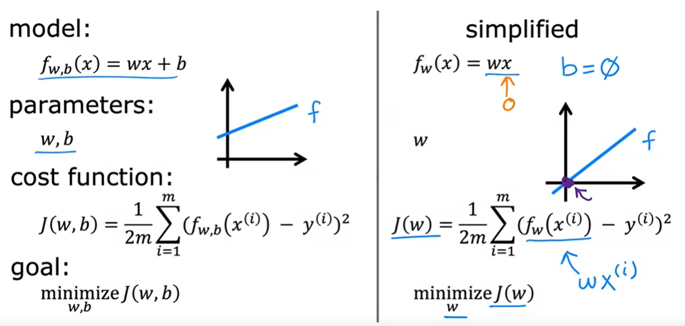

We want to fit the model using straight line, by choosing $w$ and $b$ such that it fits the training data well (i.e., by making $J(w,b)$ as small as possible).

| Term | Org. equation | Simplified |
| :---- | :-------------: | :----------: |
| Model | $f_{w, b}{(x)} = wx + b$ |  $f_{w}{(x)} = wx$ by setting $b=0$|
| Parameters | $w,b$ | $w$ |
| Cost function | $J(w,b) = \frac{1}{2m}\sum_{i=1}^{m}{(f_{w, b}{(x^{i})}-y_{i})}^{2}$ |  $J(w) = \frac{1}{2m}\sum_{i=1}^{m}{(f_{w,}{(x^{i})}-y_{i})}^{2}$ |
| Goal | $\underset{w,b}{\text{minimize}}\phantom{1}J(w,b)$ | $\underset{w}{\text{minimize}}\phantom{1}J(w)$ |

Using the simplified model, let's see how the cost function changes if we choose e different value for parameter $w$. 

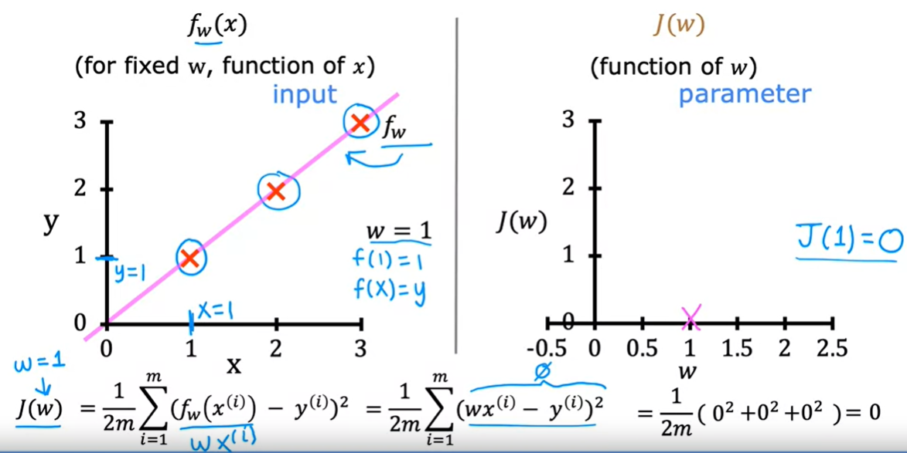

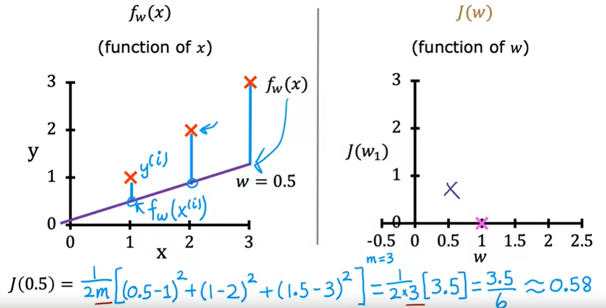

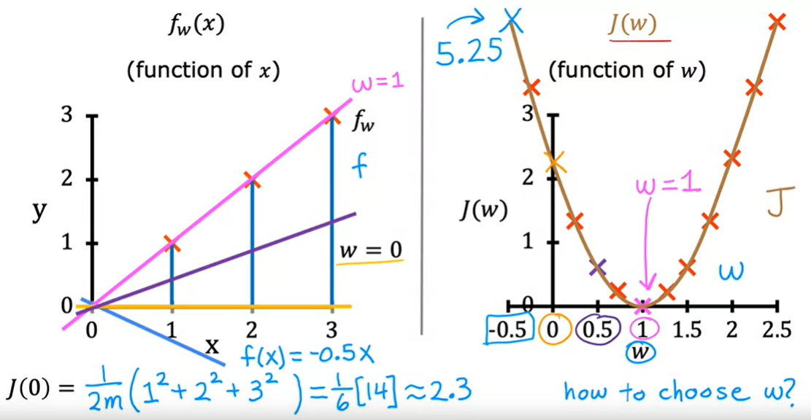

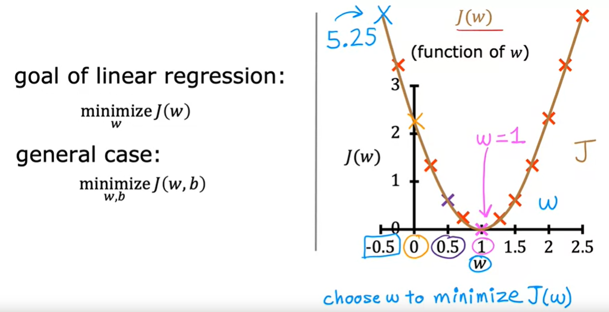

### Visualizing the cost function

### Visualization examples

### Optional lab: Cost function

## Practice Quiz": Regression Model

## Train the model with gradient descent

### Gradient descent

### Implementing gradient descent

### Gradient Descent intuition

### Learning rate

### Gradient descent for linear regression

### Running gradient descent

### Optional lab: Gradient Descent

## Practice Quiz: Train the model with gradient descent
