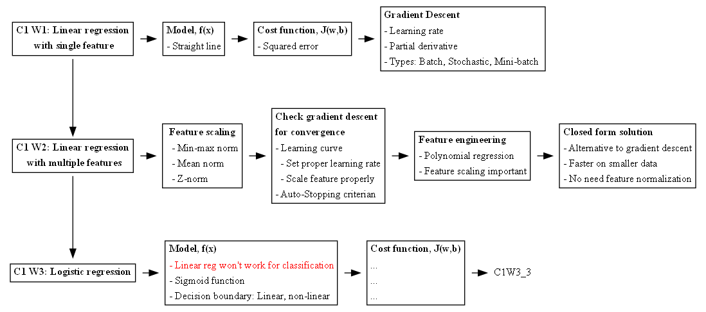

# Machine Learning Specialization

Course Link: https://www.coursera.org/specializations/machine-learning-introduction

- Course 1: Supervised Machine Learning: Regression and Classification | [Summary Notes](1_supervised_machine_learning_regression_and_classification/README.ipynb)
  - Week 1: Introduction to Machine Learning | [Notes](1_supervised_machine_learning_regression_and_classification/week1/README.md)
  - Week 2: Regression with multiple input variables | [Notes](1_supervised_machine_learning_regression_and_classification/week2/README.ipynb)
  - Week 3: Classification | [Notes](1_supervised_machine_learning_regression_and_classification/week3/README.ipynb)

# Mind Maps

# Todo's
## C1
### W2
- [ ] Run through different normalization techniques, advantages and disadvantages. Which classifiers needs normalization and why? 
- [ ] Run through Linear Regression based on OLS method
- [ ] Run through Maximum Likelihood Estimation for Logistic Regression