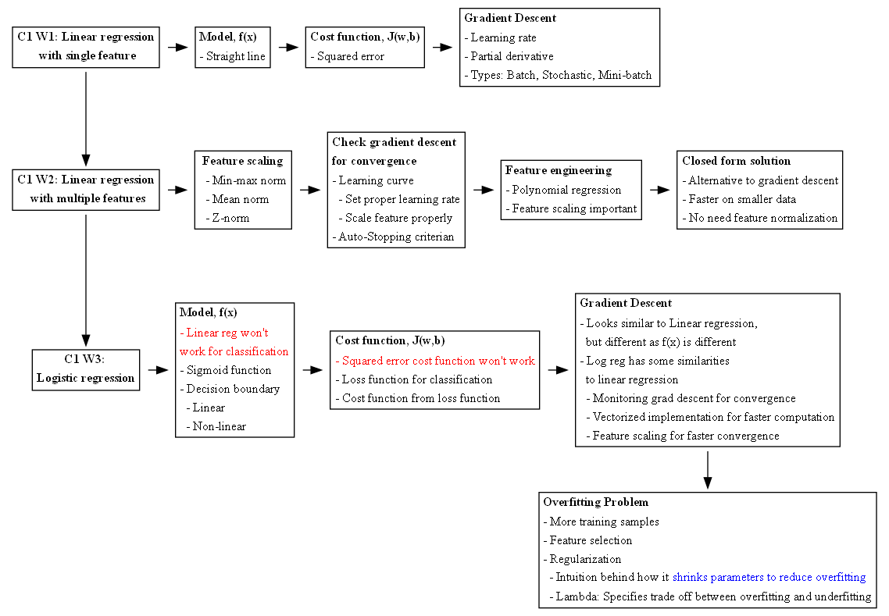

# Machine Learning Specialization

Course Link: https://www.coursera.org/specializations/machine-learning-introduction

- Course 1: Supervised Machine Learning: Regression and Classification | [Summary Notes](1_supervised_machine_learning_regression_and_classification/README.ipynb)
  - Week 1: Introduction to Machine Learning | [Notes](1_supervised_machine_learning_regression_and_classification/week1/README.md)
  - Week 2: Regression with multiple input variables | [Notes](1_supervised_machine_learning_regression_and_classification/week2/README.ipynb)
  - Week 3: Classification | [Notes](1_supervised_machine_learning_regression_and_classification/week3/README.ipynb)

- Course 2: Advanced Learning Algorithms | [Summary Notes]
  - Week 1: Neural networks | [Notes](2_advanced_learning_algorithms/week1/README.ipynb)
  - Week 2: Neural networks training | [Notes](2_advanced_learning_algorithms/week2/README.ipynb)
  - Week 3: Advice for applying machine learning | [Notes](2_advanced_learning_algorithms/week3/README.ipynb)
  - Week 4: Decision Trees | [Notes](2_advanced_learning_algorithms/week4/README.ipynb) 

# Mind Maps

# Todo's
## C1
### W2
- [ ] Run through different normalization techniques, advantages and disadvantages. Which classifiers needs normalization and why? 
- [ ] Run through Linear Regression based on OLS method
- [ ] Run through Maximum Likelihood Estimation for Logistic Regression

## C2
### W1
- [ ] Run through the *Practice Lab: Neural networks* again in a new notebook from scratch 
### W2
- [ ] Different activation functions (Why ReLU is better than sigmoid for hidden layers?)
- [ ] Log odds and logits is the same (Write the derivation and rest in the miscellaneous section)
### W4
- [ ] Decision trees - Feature importance interpretation using **SHAP**
